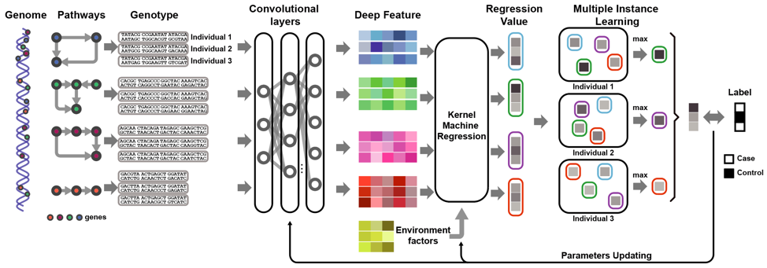
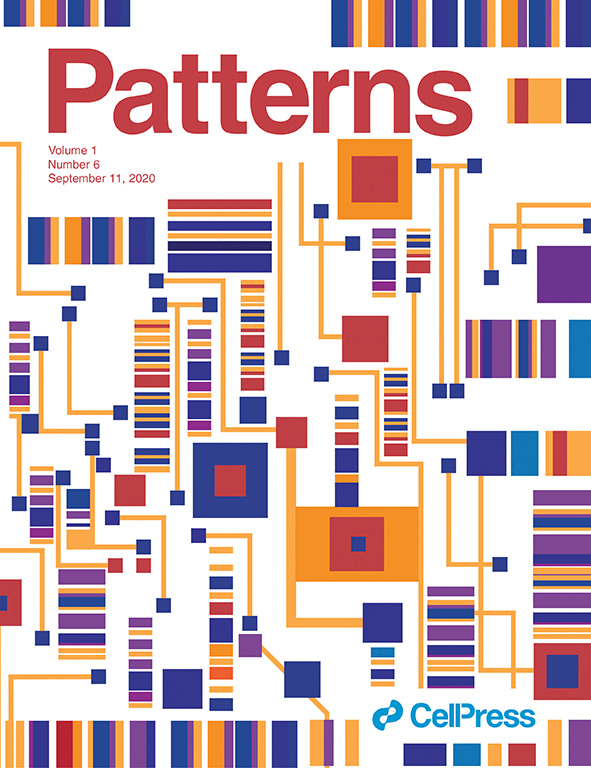

# DAK: Explaining the genetic causality for complex diseases by deep association kernel learning



Causal loci contribute to complex diseases in various manners. The comprehensive identification of suspicious genes requires a general genome-wide association study (GWAS) model that can work with different types of genetic effects. Here, we introduce a deep association kernel learning (DAK) model to enable automatic causal genotype encoding for pathway-level GWAS. Therefore, DAK is able to detect common and rare variants with complicated genetic effects that existing approaches fail. DAK is published as a cover paper in [_Patterns_](https://www.sciencedirect.com/journal/patterns/vol/1/issue/6).

|  |
> Citation: 
> Bao, Feng, et al. "Explaining the Genetic Causality for Complex Phenotype via Deep Association Kernel Learning." Patterns 1.6 (2020): 100057.


## Package requirements

DAK requires the following packages for installation:

- Python >= 3.6
- TensorFlow-GPU >= 1.4.1
- (TensorFlow >= 1.4.1 if only use CPU) 
- Numpy >= 1.13.0
- Scipy >= 1.0.0
- Pandas >= 0.22.0
- os
- time


## Usage

### Installation
```terminal
pip install dak
```

### Data preparation
1. Genotype data

    SNP loci in the same set are stored in one document in the `n * m` format, where `n` is the number of samples and `m` is the number of SNPs in the set. Each locus is in the additive genetic coding format and the `DAK.one_hot_convert(geno)` function will automatically transform the sequence  to one-hot coding data.

    A demonstration genotype format file can be found in `./demo_data/pathway_*.raw_geno.txt`

2. Phenotype data

    Phenotype information is in the `n*1` vector format with each row representing the disease status of one sample. 1: disease; 0: control.

    Refer to  `./demo_data/pheno.txt` for example.

3. Cofounding data

    Cofounding of samples is in `n*k` matrix where `k` is the number of PCs/covariants.  

4. Dividing to batches

    Dividing all data into batch files for training and inference. Users can refer to `Step 5 in Demonstration` for detailed implementation.

### DAK parameters

The parameters of DAK function is listed as follows:

```python
dak = DAK(sess,                                 #  tensorflow session that conducts learning task
          batch_path_prefix=batch_path_prefix,  #  file path of genotype data in batches
          label_path_prefix=label_path_prefix,  #  file path of label data in batches
          cov_path_prefix=cov_path_prefix,      #  file path of covariant data in 
          p_val_path=p_val_path,                #  file path of p-values by DAK
          batch_num=batch_num,                  #  the batch number of the data
          batch_size=batch_size,                #  sample number in each batch file
          pathway_num=pathway_num,              #  number of gene sets
          max_path_len=max_path_len,            #  the maximal SNP number among all gene sets 
          );
```

### Demonstration

1. Define the file path of phenotype.
```python
# set the path of label data and covariants (optinal)
label_path = './demo_data/pheno.txt'
# cov_path = '../application/LC_pathway/LC_pathway_cov.txt'
```

2. Define paths of outputs: p-value, genotype batches, label batches, one-hot coded genotype (for internal usage of DAK).
```python
# set the aim paths of result and
result_path = './demo_data/p.txt'
pathway_npy_path = './demo_data/pathway_onehot'
batch_npy_path = './demo_data/batch'
batch_label_path = './demo_data/label'
# batch_cov_path = './demo_data/cov' # (optinal)
```

3. Set the details of analyzed data
```python
pathway_num = 10 # number of gene sets
indiv_num = 1000 #number of samples in total
batch_size = 50 # number of samples in each batch file
max_path_len = 20000 # maximal SNP numbers in all gene sets
```

4. One-hot coding for genotype
```python
# convert raw format SNP into one-hot coding
raw_path = '../application/LC_pathway'
for path_iter in range(pathway_num):
    geno = pd.read_csv('./demo_data/pathway_' + str(path_iter) + 
        '.raw_geno.txt', sep='\t', header=None, index_col=None)
    geno = geno.values
    gene_one_hot = DAK.one_hot_convert(geno)
    np.save(pathway_npy_path + '/pathway_' +
            str(path_iter) + '.npy', gene_one_hot)
    print('One hot conversion for pathway ' + str(path_iter))
```

5. Divide data into batches
```python
# convert pathway to training batches
batch_index = range(0, indiv_num, batch_size)
label = pd.read_csv(label_path, sep='\t', header=0, index_col=None)
label = np.squeeze(label.values)

# cov = pd.read_csv(cov_path, sep='\t', header=0, index_col=None)
# cov = cov.values.astype(np.float)
# cov = stats.zscore(cov, axis=0)

# divided to batches
for i in range(len(batch_index) - 1):
    batch_seq = np.zeros(
        [pathway_num, batch_size, max_path_len, 3], dtype=np.int8)
    for path_iter in range(pathway_num):
        path_data_buf = np.load(
            pathway_npy_path + '/pathway_' + str(path_iter) + '.npy')
        # [N,len,3]
        path_data_buf_select = path_data_buf[batch_index[i]:batch_index[i + 1], :, :]
        batch_seq[path_iter, :, :path_data_buf_select.shape[1],
                  :] = path_data_buf_select

    batch_seq = batch_seq.astype(np.int8)
    np.save(batch_npy_path + '/batch_' + str(i) + '.npy', batch_seq)

    batch_label = label[batch_index[i]:batch_index[i + 1]]
    np.save(batch_label_path + '/batch_' + str(i) + '.npy', batch_label)

    # batch_cov = cov[batch_index[i]:batch_index[i + 1], :]
    # np.save(batch_cov_path + '/batch_' + str(i) + '.npy', batch_cov)

    print('make batch %d' % i)
```

6. Model training and significance test
```python
# training DAK and test pathway
DAK.train(batch_npy_path, batch_label_path, None, result_path,
          batch_num=len(batch_index) - 1, batch_size=batch_size, pathway_num=pathway_num, max_path_len=max_path_len)
```
Results were store in path specified in `result_path`.

# Example

## Code
See `demo.py`.

## Data
In `./demo_data/`:

- Genotype: `./demo_data/pathway_*.raw_geno.txt`
- Phenoytpe: `./demo_data/pheno.txt`

## Copyright
Software provided as is under MIT License.

Permission is hereby granted, free of charge, to any person obtaining a copy of this software and associated documentation files (the "Software"), to deal in the Software without restriction, including without limitation the rights to use, copy, modify, merge, publish, distribute, sublicense, and/or sell copies of the Software, and to permit persons to whom the Software is furnished to do so, subject to the following conditions:

The above copyright notice and this permission notice shall be included in all copies or substantial portions of the Software.

THE SOFTWARE IS PROVIDED "AS IS", WITHOUT WARRANTY OF ANY KIND, EXPRESS OR IMPLIED, INCLUDING BUT NOT LIMITED TO THE WARRANTIES OF MERCHANTABILITY, FITNESS FOR A PARTICULAR PURPOSE AND NONINFRINGEMENT. IN NO EVENT SHALL THE AUTHORS OR COPYRIGHT HOLDERS BE LIABLE FOR ANY CLAIM, DAMAGES OR OTHER LIABILITY, WHETHER IN AN ACTION OF CONTRACT, TORT OR OTHERWISE, ARISING FROM, OUT OF OR IN CONNECTION WITH THE SOFTWARE OR THE USE OR OTHER DEALINGS IN THE SOFTWARE.

